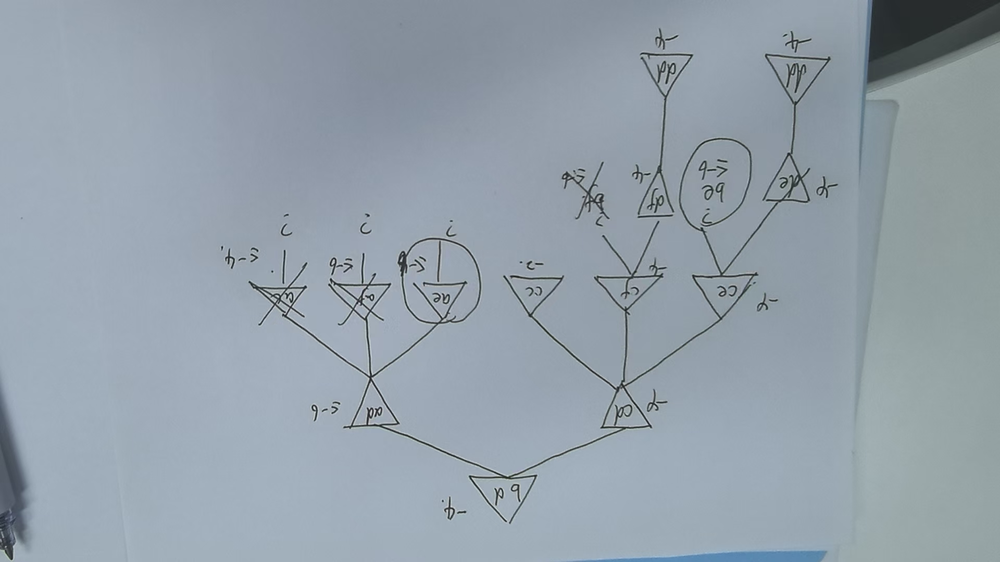

<!--
 * @Author: Tangxuan
 * @Date: 2024-12-05 16:24:58
 * @LastEditTime: 2024-12-05 16:35:29
 * @LastEditors: Tangxuan
 * @Description: Created By Tangxuan And Be Protected
-->
<!-- ![[.\Pasted image 20241111085544.png]] -->

a: 
如果我们考虑所有的（x，y）点，那么将会有无限多的状态和路径。(回答出无限、无穷，并有相应的分析即可，状态：12.5分，路径：12.5分)
b: 
对于这个问题，我们认为起点和终点是顶点。两点之间的最短距离是一条直线，如果因为某些障碍物的存在而无法直线行走，那么次短的距离就是一系列尽可能少偏离直线的线段序列，这些线段首尾相连。因此，这个序列的第一个线段必须从起点出发，到达障碍物上的一个切点——任何给障碍物更大周长的路径都会更长。因为障碍物是多边形的，所以切点必须在障碍物的顶点上，因此整个路径必须从一个顶点到另一个顶点。所以现在的状态空间是顶点的集合，在图3.31中，这样的顶点共有35个。
（给出分析：12.5分，定义出状态空间：12.5分，回答出状态空间大小：12.5分）
c: 
1. actions函数规范来说，输入应该是一个状态（当然这里状态就是定点），输出是一组动作（当前顶点与邻居顶点的连线集合），这里邻居顶点有两种：同一多边形上的邻居结点，不同多边形上可直线连接的顶点
- **输入**：一个顶点 v。
- **输出**：一个集合，包含所有可以通过直线连接到达的邻居顶点。每个邻居顶点可以是：
    - 与当前顶点直接连接的其他顶点，且不受任何障碍物阻挡。
    - 同一多边形上的邻居。
    - 其他多边形上的可通过直线连接的顶点（如果没有障碍物阻挡）。(12.5)
2. HEURISTIC 函数(10分)
- **输入**：当前状态
- **输出**：从当前顶点 v 到目标顶点 G 的直线距离。该距离计算采用欧几里得公式，即： $\text{distance} = \sqrt{(x_2 - x_1)^2 + (y_2 - y_1)^2}​$ 其中 (x1,y1)是当前顶点的坐标，(x2,y2) 是目标顶点的坐标。
3. GOAL-TEST 函数(5分)
- **输入**：一个顶点 v。
- **输出**：如果当前顶点 v 等于目标顶点 G，则返回 True，否则返回 False。
4. result(s，a)  (5)
5. path-cost（s，a，s'）bu(5)

a: （用代码表示即可）
1. **环境实现**：(10分)
    - 定义一个环境类，包含顶点和障碍物的位置。
    - 实现感知函数，返回相对可见顶点的位置和类型（左边缘、右边缘或内部点）。
    - 实现动作函数，计算路径与障碍物的交点，更新代理的位置。
2. **问题解决代理**：(10分)
    - 代理需要在每次传送后重新制定问题，使用感知信息来推测当前位置。
    - 设定奖励与惩罚机制：每移动一单位距离扣1分，达到目标时奖励1000分。
b: （20分）
- 在每个回合中，代理可以输出其当前位置、采取的行动、是否遇到障碍物、以及当前得分。
- 记录每次达到目标的次数和总得分。
- 可以使用日志文件或控制台输出进行记录。
c: （20分）
1. **修改环境**：在代理被传送后，引入随机选择一个可见顶点作为新位置。
2. **代理行为**：
    - 代理检测到位置变化后，使用可见顶点信息推测当前位置。
    - 制定回到原来位置的计划，并尝试执行。
    - 示例：代理在两次运动错误后成功到达目标，记录每次错误后的状态和决策过程。
d: 
1. **实现两种策略**：（10分）
    - 第一种策略：计算从当前位置到原路线最近顶点的距离，执行该动作。
    - 第二种策略：使用当前可见顶点信息，重新规划到目标的最短路径。
2. **性能比较**：（给出具体数据比较）（10分）
    - 记录每种策略的成功率、总得分和所需时间。
    - 考虑搜索成本的影响，可能需要为重新规划过程引入时间惩罚。
e:
1. **问题分析**：（10分）
    - 代理可能无法唯一确定其位置，因为不同位置可能产生相同的感知结果。
2. **解决方案**：（10分）
    - 代理需要通过其他信息（如历史位置、动作）来减少不确定性。
    - 解决方案可能包括使用概率模型或基于记忆的策略，以便在面临相同视角时做出合理决策。
<!-- ![[Pasted image 20241205075255.png]] -->

a，b，c如下图，
<!-- ![[./微信图片_20241205111148.jpg]] -->

d:两个玩家之间的最短路径长度是总捕获时间的下界。因为玩家轮流移动，所以不需要将最短路径长度除以二。因此，带有问号的叶子节点的捕获时间大于或等于从根节点到该叶子节点的成本与最短路径长度之和。注意，这个界限是在假设逃避者表现非常差的情况下得出的。一个节点的真实值来自于双方的最佳策略，因此，通过假设更好的策略，我们可以得到更好的界限。例如，我们可以从逃避者简单地来回移动而不是向追捕者移动的成本中得到一个更好的界限。
e:如上图
f:让我们将树的根设为追捕者当前所在的节点。（也就是说，将树从那个节点提起，让所有其他分支垂下来。）逃避者要么在根节点，这种情况下追捕者已经赢了，要么在某个子树中。追捕者会沿着通往那个子树的分支前进。这个过程最多重复d次，d是原始子树的最大深度，直到追捕者抓住逃避者或者到达一个叶节点。由于叶节点没有子树，逃避者必须在那个节点上。

<!-- ![[Pasted image 20241204155008.png]]
![[Pasted image 20241204155016.png]]
![[Pasted image 20241204155026.png]] -->

## 6.2
a：定义变量集合 （20分）
b：定义变量的值域（20分）
c：说明变量之间是如何约束的（20分）
d：定义相关函数（30分，Action，Result, sensible objective函数各10分），给出局部搜索算法 （10分）

a：变量集合为棋盘上的每一个位置，一共有n^2 个
b：每一个变量都可以取两个值 （占用，闲置）
c：骑士移动的约束：每一对通过骑士移动的两个方格（即骑士当前位置和即将去的位置）相互约束，即这两个方格不能同时为占用，另一种说法是，一旦骑士占用了某个方格，那么所有可以从该方格移动到的方格都不能被占用。总占用方格的约束：棋盘上总占用方格数量为K
d：
##### **定义Action函数**
- **添加骑士**：在一个未被攻击的方格上放置骑士。
- **移除骑士**：从一个被占据的方格中移除骑士。
- **移动骑士**：将一个骑士从一个方格移动到另一个未被攻击的方格。
##### **定义结果函数**
- **添加骑士**：在方格 (x,y)(x,y) 上放置骑士，将 `board[x][y]` 设为 `True`，并更新所有被该骑士攻击的方格为不可用。
- **移除骑士**：将方格 (x,y)(x,y) 的状态设为 `False`，并恢复所有被该骑士攻击的方格为可用。
- **移动骑士**：将骑士从方格 (x1,y1)(x1​,y1​) 移动到方格 (x2,y2)(x2​,y2​)，更新这两个方格的状态，并相应地更新被攻击的方格。
##### **定义目标函数**
- **目标函数**：计算当前棋盘上被放置的骑士数量
##### **局部搜索算法**
1. **初始化**：从一个初始状态（可以是空棋盘）开始。
2. **评估**：计算当前状态的目标函数值。
3. **选择操作**：选择一个动作（添加、移除或移动骑士）。
4. **执行动作**：根据结果函数更新状态。
5. **更新目标**：计算新的目标函数值。
6. **检查停止条件**：如果目标函数值没有改善或达到某个阈值，则停止搜索；否则，返回步骤3。

